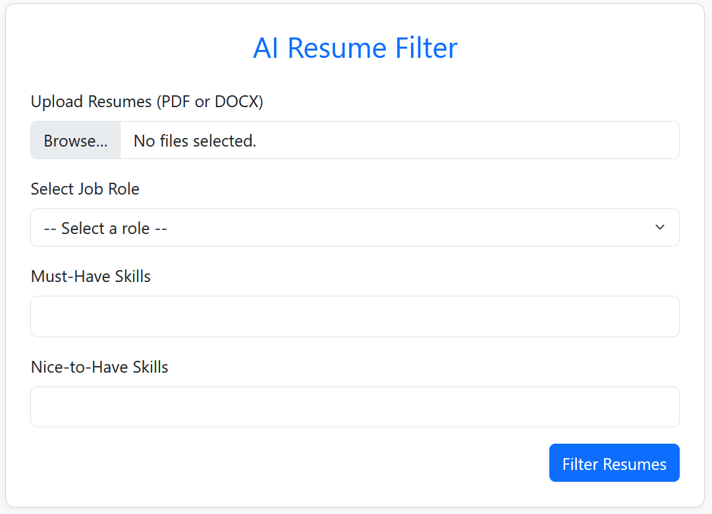
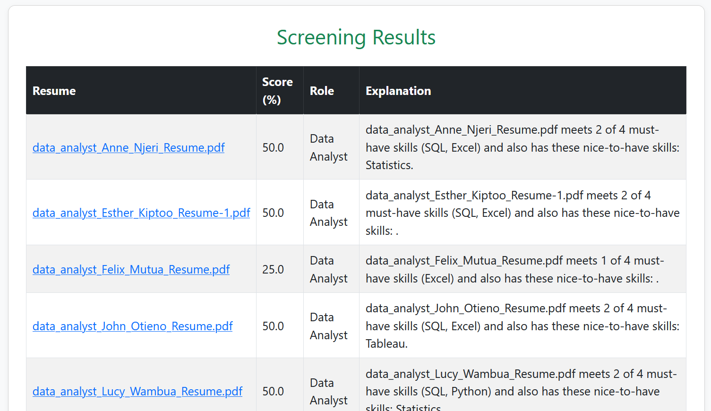

# AI Resume Filter

A Flask-based web application that automatically filters resumes using AI-powered keyword extraction. The app evaluates uploaded resumes based on must-have and nice-to-have skills defined for various job roles.

---

## Features

- Upload multiple resumes (PDF or DOCX)
- Filter candidates using selected must-have and nice-to-have skills
- Uses spaCy for natural language processing
- Dynamically configurable roles and skills
- Generates human-readable explanations for filtering decisions
- SQLite database for storing review results

---

## Tech Stack

- **Backend**: Python, Flask
- **Frontend**: HTML, Bootstrap, JavaScript
- **AI/NLP**: spaCy
- **Database**: SQLite (via SQLAlchemy)

---

## Setup Instructions

1. **Clone the repository**  
   ```bash
   git clone https://github.com/your-username/ai_resume_filter.git
   cd ai_resume_filter
   ```

2. **Create a virtual environment**
    ```bash
    python -m venv venv
    source venv/bin/activate  # or venv\Scripts\activate on Windows
    ```

3. **Install dependencies**
    ```bash
    pip install -r requirements.txt
    ```

4. **Run the app**
    ```bash
    flask run
    ```

---

## Screenshots
### 1. Upload Page


### 2. Screening Results Page


