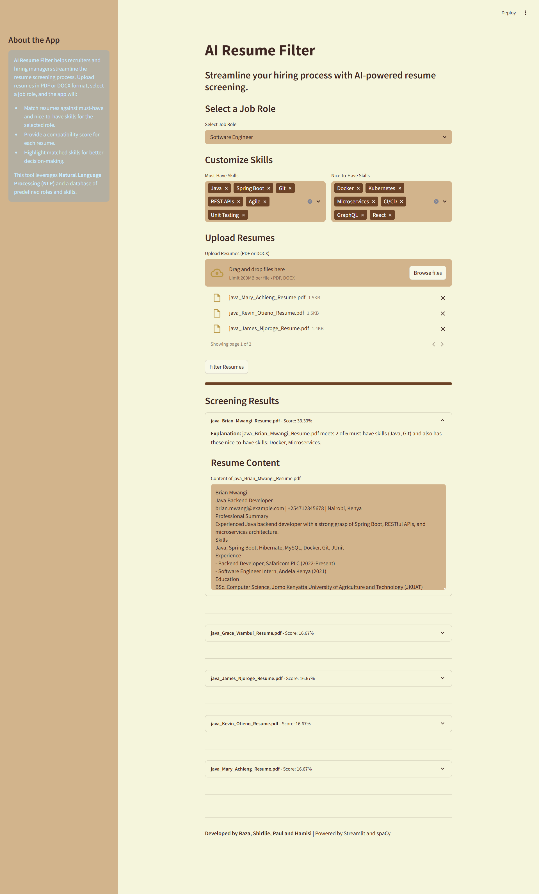

# AI Resume Filter

A Streamlit-based web application that automatically filters resumes using AI-powered keyword extraction. The app evaluates uploaded resumes based on must-have and nice-to-have skills defined for various job roles.

---

## Features

- Upload multiple resumes (PDF or DOCX).
- Filter candidates using selected must-have and nice-to-have skills.
- Uses spaCy for natural language processing.
- Dynamically configurable roles and skills.
- Displays resume content directly in the app for review.
- SQLite database for storing predefined roles and skills.

---

## Tech Stack

- **Backend**: Python, Streamlit
- **AI/NLP**: spaCy
- **Database**: SQLite (via SQLAlchemy)

---

## Setup Instructions

1. **Clone the repository**  
   ```bash
   git clone https://github.com/your-username/ai_resume_filter.git
   cd ai_resume_filter
   ```

2. **Create a virtual environment (Optional but recommended)**
    ```bash
    python -m venv venv
    venv\Scripts\activate  # On Windows
    # or
    source venv/bin/activate  # On macOS/Linux
    ```

3. **Install dependencies**
    ```bash
    pip install -r requirements.txt
    ```

4. **Seed the database**
    ```bash
    python seed.py
    ```

5. **Run the app**
    ```bash
    venv\Scripts\activate #to activate the venv first
    streamlit run app.py
    ```

---

## Screenshots
### 1. landing Page
.png)

### 2. Screening Results Page


---

## How It Works

1. **Upload Resumes**: Users can upload multiple resumes in PDF or DOCX format.
2. **Select a Job Role**: Choose a predefined job role to filter resumes against.
3. **Skill Matching**: The app matches resumes against must-have and nice-to-have skills using spaCy for NLP.
4. **View Results**: The app displays a compatibility score and highlights matched skills for each resume.
5. **Resume Content**: Users can view the content of each resume directly in the app.

---

## Contributing

Contributions are welcome! Please fork the repository and submit a pull request for any improvements or bug fixes.

---

## License

This project is licensed under the MIT License. See the `LICENSE` file for details.

